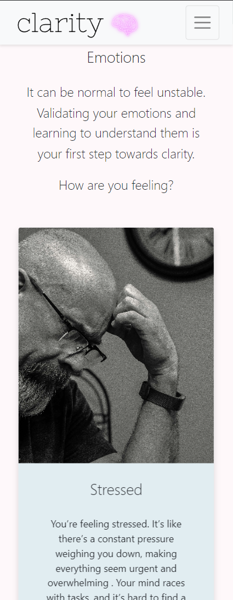
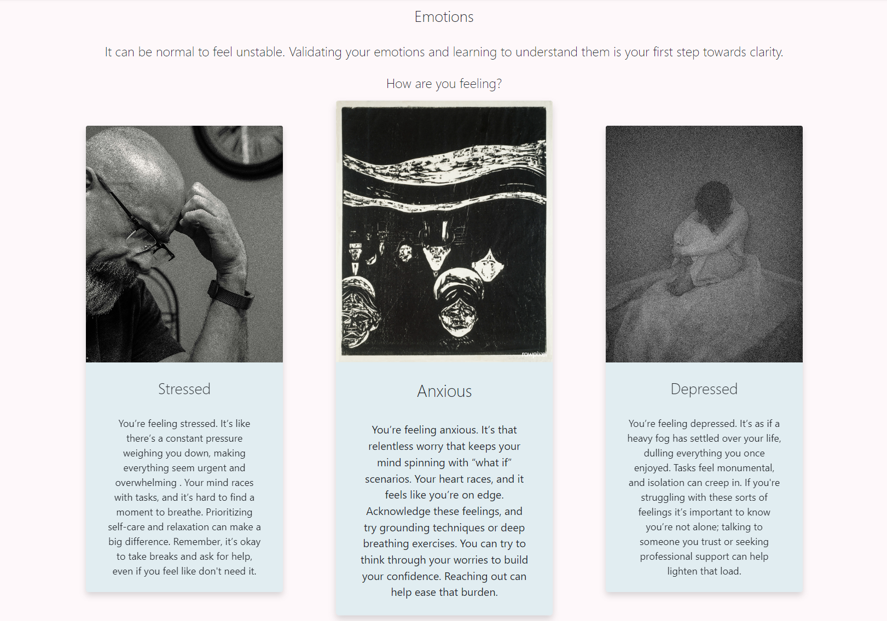
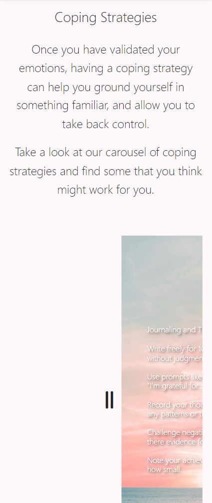
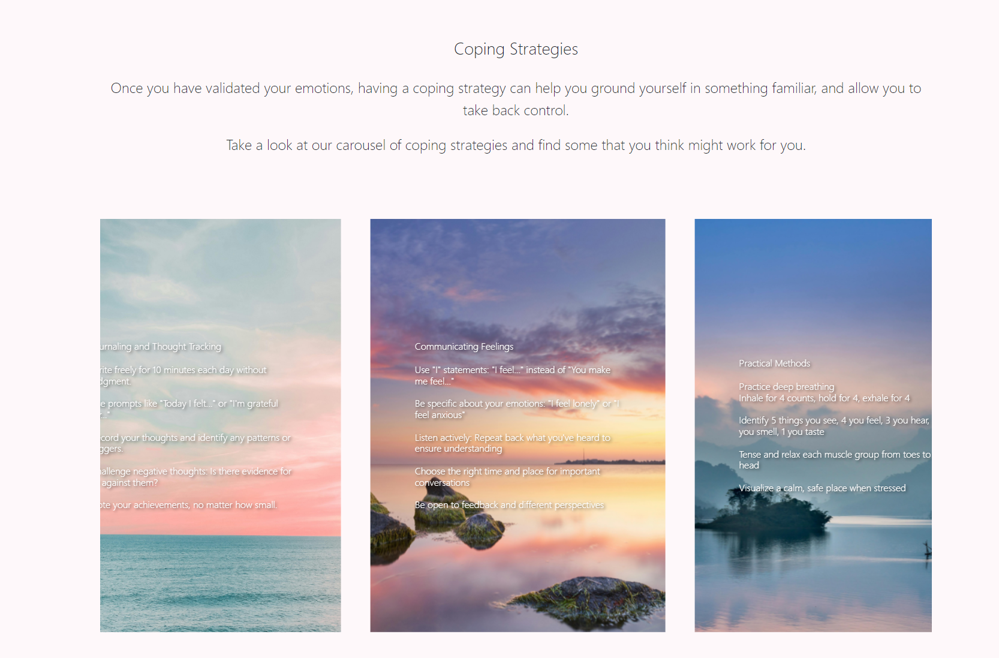
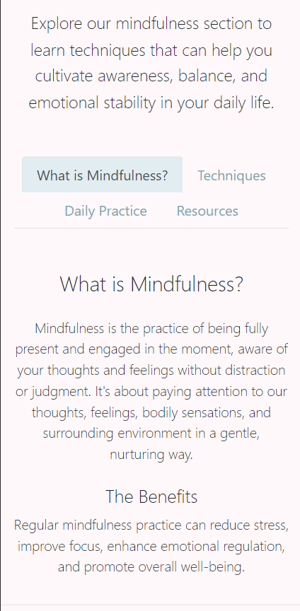
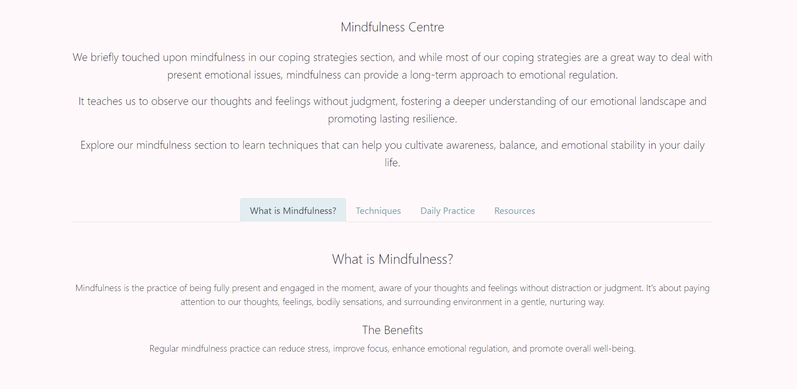

# Clarity - Mental Health Support Website

Clarity is a responsive, single-page website designed to provide support and resources for people feeling overwhelmed mentally. It offers information on negative emotions, coping strategies, mindfulness techniques, a contact form and external resources to help users understand and manage their emotional state.

## Table of Contents
1. [UX/UI](#uxui)
2. [Features](#features)
3. [Testing](#testing)
4. [Deployment](#deployment)
5. [Credits](#credits)
6. [Planning and Development Process](#planning-and-development-process)
7. [AI Assistance](#ai-assistance)

## UX/UI

The UX/UI design for Clarity follows a structured approach based on the five planes of user experience:

### Strategy
- Created user stories to define project objectives and user needs
- Primary goal: Provide a supportive resource for individuals dealing with mental health challenges

### Scope
- Outlined core features based on user stories:
  
  MVP-
  - Easy navigation
  - supportive design:
  - Mobile accessibility
  - Emotion information section
  - Coping strategies section
  Extra-content
  - Mindfulness resources
  - External help resources
  - Contact form

- Outlined some nice to have features for future development

### Structure
- Chose a single-page layout for ease of navigation
- Planned to implement smooth scrolling between sections
- Planned information architecture to present emotional information effectively

### Skeleton
- Designed wireframes incorporating all key sections
- Ensured logical flow of information

### Surface
- Selected a calming color scheme focusing on soft blues and pinks
- Chose typography and visual elements to enhance readability and user engagement
- Designed visual elements (cards, buttons, form) to convey a supportive atmosphere

The UX design process was guided by a flow chart, which can be found here: [UX flow chart](https://guymitchy.github.io/UX-Flow/)

## Features

### Existing Features

#### Navigation Bar
- Full responsive navigation bar with links to all sections
- Sticky navigation that collapses into a hamburger menu on smaller screens
- Smooth scrolling implemented for better user experience

#### Landing Page (Home Section)
- Hero image with welcoming text overlay
- Brief introduction to Clarity's purpose

[Landing Page Mobile](./README-images/components/hero-mobile.png)

#### Emotions Section
- Information about six common emotional states: Stressed, Anxious, Depressed, Angry, Lonely, and Bereft
- Each emotion presented in a card with an image and descriptive text
- Hover effect on cards for visual feedback

#### Coping Strategies Section
- Interactive carousel featuring various coping strategies
- Swipe or drag navigation for both desktop and mobile devices (Swipe working in Devtools emulators but not on devices)
- Each strategy presented on a background image with accompanying text

#### Mindfulness Centre
- Tabbed interface organizing information into "What is Mindfulness?", "Techniques", "Daily Practice", and "Resources"
- Each tab provides relevant information and guidance on mindfulness practices

#### Get More Help Section
- Accordion-style list of external mental health resources
- Links to organizations such as Samaritans, Mind, NHS Mental Health Services, and others

#### Contact Form
- "Reach Out" button in navigation opens a modal contact form
- Implemented using Google Forms for simplicity and reliability

#### Footer
- Social media links
- Quick links to Privacy Policy, Terms of Use, and Copyright information

### Features Left to Implement

Community Forum: A moderated space for users to share experiences and support each other.

Personalized Resource Recommendations: Based on user input, suggest relevant articles or coping strategies.

Interactive Breathing Exercise: A visual guide to help users practice deep breathing techniques.

Expert Q&A Section: Periodic posts where mental health professionals answer common questions.

Privacy-Focused User Accounts: Allow users to save their progress and preferences securely.

Chatbot Support: An AI-driven chatbot to provide immediate, basic support and guide users to appropriate resources.

## Testing

### Validator Testing
- HTML: No errors were returned when passing through the official [W3C validator](https://validator.w3.org/)
- CSS: No errors were found when passing through the official [(Jigsaw) validator](https://jigsaw.w3.org/css-validator/)

### Manual Testing
- The website was tested on various browsers (Chrome, Edge, DuckDuckGo, Safari) and devices (Desktop, Tablet, Mobile) to ensure responsiveness and functionality
- All links were checked to ensure they are working correctly and open in new tabs where appropriate
- The contact form was tested to ensure it submits correctly and provides appropriate feedback to the user (Feedback needs improving - Autofill not functional, there was a warning/error message in devtools about this)

### Bugs and Fixes

#### Fixed Bugs
1. Hero background image height issue: Adjusted image positioning to resolve layout problems when the hamburger menu was opened
2. Full-width layout: Removed padding from containers for nav and hero sections
3. Card centering: Centered cards in the Emotions section within their container
4. Card growth space: Added space above cards to accommodate hover effect growth
5. Carousel image consistency: Adjusted the journaling image in the carousel to match the height of other images
6. Deployed image display: Fixed issues with images not showing in the deployed version

#### Unfixed Bugs
1. Form title: The "RSVP" title on the contact form modal needs to be changed to a more appropriate title
2. Mobile swipe inconsistency: Swipe functionality on the coping strategies carousel works inconsistently across different mobile devices and sometimes requires a hard reload in mobile emulators

## Deployment

The site was deployed to GitHub pages using the following steps:

1. In the GitHub repository, navigate to the Settings tab
2. From the source section drop-down menu, select the Main Branch
3. Once the main branch has been selected, the page will be automatically refreshed with a detailed ribbon display to indicate the successful deployment

The live link can be found here - [Clarity Live Site](https://your-live-site-url-here.com)

## Credits

### Content
- The text content for the Emotions and Coping Strategies sections was written by the developer and Claude AI with inspiration from various mental health resources
- The Mindfulness Centre content was adapted from mindfulness.org and headspace.com
- External resource information was sourced from the respective organizations' websites

### Media
- The hero image and background images for the coping strategies carousel were obtained from Pexels.com
- The emotion card images were sourced from a combination of Pexels.com and public domain art repositories
- Icons used in the website are from Font Awesome

### Code
- The smooth scrolling navigation was implemented with guidance from Vlaude Ai and CSS-Tricks - Then modified to fit the project needs
- The carousel for coping strategies was adapted from a CodePen by Hyperplexed and modified for touch functionality.
- Bootstrap 4.6 documentation was used for the overall responsive layout and components such as the navbar and accordion

## Planning and Development Process

The development of Clarity followed a unique and innovative approach, leveraging AI assistance for enhanced planning and content creation:

1. **AI-Assisted Planning**: The project planning was conducted in conversation with Anthropic's Claude AI. This method was chosen to facilitate a more fluid ideation process and ensure alignment between planning and content creation.

2. **Comprehensive Documentation**: The planning process resulted in a solid foundation and permanent record that can be easily edited and reused as a template for future projects.

3. **Structured Approach**: The planning began with a UX/UI design flow chart and project brief criteria. Each part of the design process, from user stories to user testing, was discussed in detail.

4. **Kanban Board Creation**: A rudimentary Kanban board was created, listing tasks for each plane of the UX design process. This served as a progress tracking tool throughout the project.

5. **Iterative Development**: The development process involved moving through each stage, discussing content, functionality, and implementation with Claude AI. The AI was prompted to act as a tutor, providing guidance without directly creating code unless specifically asked to explain certain structures and components.

6. **Documentation**: The full plan and Kanban board can be found here: [Plan and Kanban](./Plan-and-Kanban.md)

This approach allowed for a thorough exploration of ideas, consistent alignment between planning and execution, and a well-documented development process.

## AI Assistance

Throughout the development of Clarity, AI assistance was utilized in various aspects of the project. Here are some key areas where AI, specifically Claude, provided support:

1. **Smooth Scrolling Implementation**: The smooth scrolling navigation was implemented with guidance from Claude AI. The AI provided explanations and suggestions for creating a smooth scrolling effect that adjusts for the height of the navbar.

2. **Carousel Functionality**: The interactive carousel in the Coping Strategies section was developed with AI assistance. Claude helped in adapting and modifying existing carousel code to fit the project's specific needs, including touch event handling for mobile devices.

3. **Responsive Design**: AI was consulted for responsive design techniques, ensuring the website looks and functions well across various device sizes.

4. **Content Creation**: While the core content was mostly AI written, I refined and expanded on certain sections, ensuring clarity and consistency in tone and formatting.

5. **Debugging**: When encountering bugs, such as the hero image height issue or carousel image consistency, AI was consulted for potential solutions and best practices.

6. **Code Optimization**: AI provided suggestions for optimizing code structure and improving performance, particularly in JavaScript functions.

It's important to note that while AI was a valuable tool in the development process, all final decisions and implementations were made by the developer. The AI served as a guide and collaborator, enhancing the development process rather than replacing human creativity and decision-making.

